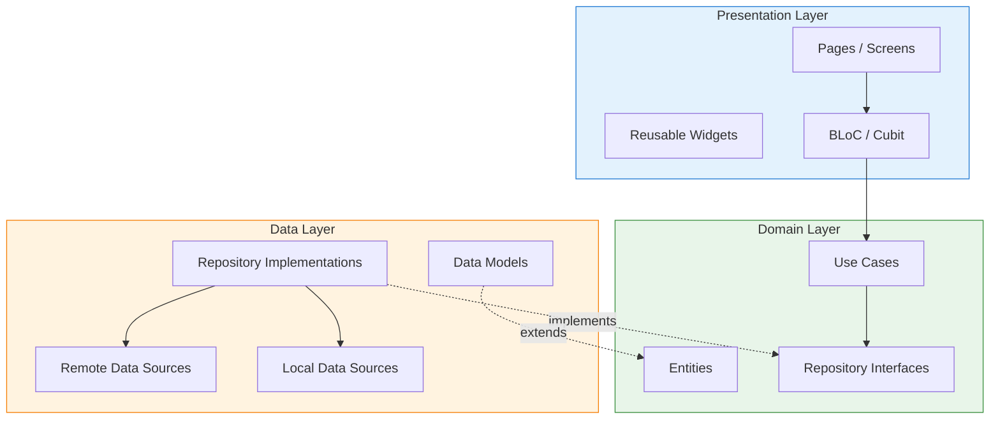
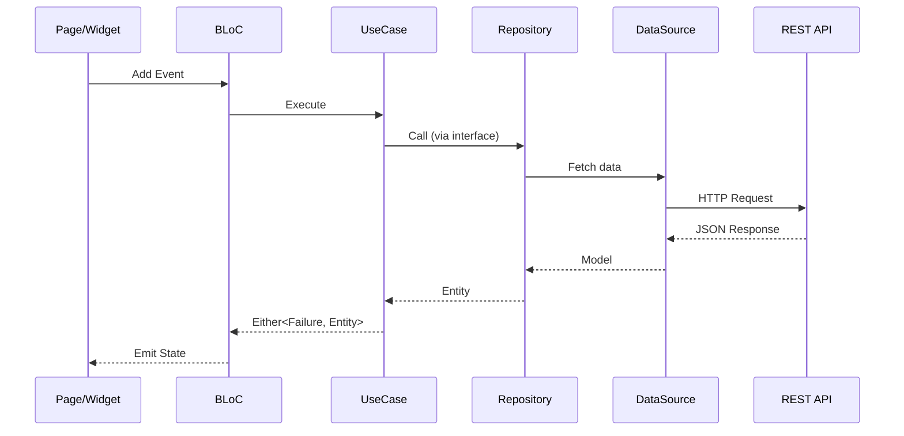

# Stitch ERP Flutter App — Architecture & Development Plan

A Flutter mobile application (iOS & Android) for enterprise resource planning, built with a clean, modular architecture following **SOLID** and **KISS** principles.

---

## UI Design Reference

We have **18 UI templates** in [stitch_erp_app_development](file:///d:/SourceCode/go-lang/app/ui-design/stitch_erp_app_development) covering:

````carousel

<!-- slide -->

<!-- slide -->

<!-- slide -->

<!-- slide -->

<!-- slide -->

````

---

## Design Principles

| Principle | How We Apply It |
|---|---|
| **S** — Single Responsibility | Each class/widget does ONE thing. Separate data, domain, and presentation layers |
| **O** — Open/Closed | Use abstract classes for repositories and services; new modules extend, never modify core |
| **L** — Liskov Substitution | All repository implementations are interchangeable (mock ↔ API) |
| **I** — Interface Segregation | Small, focused abstract classes per feature (no god-interfaces) |
| **D** — Dependency Inversion | Depend on abstractions; inject via `get_it` + `injectable` |
| **KISS** | Flat feature folders, no over-engineering, minimal boilerplate |

---

## Folder Structure

```
erp-app/
├── android/                          # Android platform files
├── ios/                              # iOS platform files
├── assets/
│   ├── images/                       # App images, icons, logos
│   ├── fonts/                        # Custom font files
│   └── icons/                        # SVG / custom icons
├── lib/
│   ├── main.dart                     # App entry point
│   ├── app.dart                      # MaterialApp / root widget
│   │
│   ├── config/                       # ── App Configuration ──
│   │   ├── routes/
│   │   │   ├── app_router.dart       # Route definitions (GoRouter)
│   │   │   └── route_names.dart      # Route name constants
│   │   ├── theme/
│   │   │   ├── app_theme.dart        # ThemeData for light/dark
│   │   │   ├── app_colors.dart       # Color palette constants
│   │   │   ├── app_text_styles.dart  # Typography styles
│   │   │   └── app_dimensions.dart   # Spacing, radius constants
│   │   └── di/
│   │       └── injection.dart        # Dependency injection setup
│   │
│   ├── core/                         # ── Shared Core ──
│   │   ├── constants/
│   │   │   ├── api_constants.dart    # Base URLs, endpoints
│   │   │   ├── app_constants.dart    # App-wide constants
│   │   │   └── storage_keys.dart     # Shared prefs / secure storage keys
│   │   ├── errors/
│   │   │   ├── failures.dart         # Failure classes (ServerFailure, etc.)
│   │   │   └── exceptions.dart       # Custom exception classes
│   │   ├── network/
│   │   │   ├── api_client.dart       # Dio/HTTP client setup
│   │   │   ├── api_interceptor.dart  # Auth token interceptor
│   │   │   └── network_info.dart     # Connectivity checker
│   │   ├── utils/
│   │   │   ├── validators.dart       # Email, password validators
│   │   │   ├── date_formatter.dart   # Date/time formatting helpers
│   │   │   └── extensions.dart       # Dart extension methods
│   │   └── widgets/                  # Shared reusable widgets
│   │       ├── app_button.dart       # Primary/secondary buttons
│   │       ├── app_text_field.dart   # Styled text input
│   │       ├── app_card.dart         # Reusable card widget
│   │       ├── loading_overlay.dart  # Loading spinner overlay
│   │       ├── status_badge.dart     # Status pill badges
│   │       └── bottom_nav_bar.dart   # Bottom navigation bar
│   │
│   └── features/                     # ── Feature Modules ──
│       │
│       ├── auth/                     # 🔐 AUTHENTICATION
│       │   ├── data/
│       │   │   ├── models/
│       │   │   │   └── user_model.dart
│       │   │   ├── datasources/
│       │   │   │   ├── auth_remote_datasource.dart
│       │   │   │   └── auth_local_datasource.dart
│       │   │   └── repositories/
│       │   │       └── auth_repository_impl.dart
│       │   ├── domain/
│       │   │   ├── entities/
│       │   │   │   └── user.dart
│       │   │   ├── repositories/
│       │   │   │   └── auth_repository.dart         # Abstract
│       │   │   └── usecases/
│       │   │       ├── login_usecase.dart
│       │   │       ├── logout_usecase.dart
│       │   │       └── forgot_password_usecase.dart
│       │   └── presentation/
│       │       ├── bloc/
│       │       │   ├── auth_bloc.dart
│       │       │   ├── auth_event.dart
│       │       │   └── auth_state.dart
│       │       ├── pages/
│       │       │   ├── login_page.dart
│       │       │   └── forgot_password_page.dart
│       │       └── widgets/
│       │           ├── login_form.dart
│       │           └── biometric_button.dart
│       │
│       ├── dashboard/                # 📊 DASHBOARD
│       │   ├── data/
│       │   │   ├── models/
│       │   │   │   ├── kpi_model.dart
│       │   │   │   └── activity_model.dart
│       │   │   ├── datasources/
│       │   │   │   └── dashboard_remote_datasource.dart
│       │   │   └── repositories/
│       │   │       └── dashboard_repository_impl.dart
│       │   ├── domain/
│       │   │   ├── entities/
│       │   │   │   ├── kpi.dart
│       │   │   │   └── recent_activity.dart
│       │   │   ├── repositories/
│       │   │   │   └── dashboard_repository.dart
│       │   │   └── usecases/
│       │   │       └── get_dashboard_data_usecase.dart
│       │   └── presentation/
│       │       ├── bloc/
│       │       │   └── dashboard_bloc.dart
│       │       ├── pages/
│       │       │   └── dashboard_page.dart
│       │       └── widgets/
│       │           ├── kpi_card.dart
│       │           ├── quick_actions.dart
│       │           └── activity_feed.dart
│       │
│       ├── modules/                  # 📦 MODULE MENU
│       │   └── presentation/
│       │       ├── pages/
│       │       │   ├── module_grid_page.dart
│       │       │   └── module_list_page.dart
│       │       └── widgets/
│       │           ├── module_tile.dart
│       │           └── module_category_section.dart
│       │
│       ├── employees/                # 👥 EMPLOYEE / HR
│       │   ├── data/
│       │   │   ├── models/
│       │   │   │   └── employee_model.dart
│       │   │   ├── datasources/
│       │   │   │   └── employee_remote_datasource.dart
│       │   │   └── repositories/
│       │   │       └── employee_repository_impl.dart
│       │   ├── domain/
│       │   │   ├── entities/
│       │   │   │   └── employee.dart
│       │   │   ├── repositories/
│       │   │   │   └── employee_repository.dart
│       │   │   └── usecases/
│       │   │       └── get_employees_usecase.dart
│       │   └── presentation/
│       │       ├── bloc/
│       │       │   └── employee_bloc.dart
│       │       ├── pages/
│       │       │   ├── employee_directory_page.dart
│       │       │   └── employee_contact_grid_page.dart
│       │       └── widgets/
│       │           ├── employee_list_tile.dart
│       │           └── employee_contact_card.dart
│       │
│       ├── attendance/               # ⏱️ ATTENDANCE
│       │   ├── data/
│       │   │   ├── models/
│       │   │   │   └── attendance_model.dart
│       │   │   ├── datasources/
│       │   │   │   └── attendance_remote_datasource.dart
│       │   │   └── repositories/
│       │   │       └── attendance_repository_impl.dart
│       │   ├── domain/
│       │   │   ├── entities/
│       │   │   │   └── attendance_record.dart
│       │   │   ├── repositories/
│       │   │   │   └── attendance_repository.dart
│       │   │   └── usecases/
│       │   │       ├── check_in_usecase.dart
│       │   │       └── get_attendance_history_usecase.dart
│       │   └── presentation/
│       │       ├── bloc/
│       │       │   └── attendance_bloc.dart
│       │       ├── pages/
│       │       │   ├── attendance_home_page.dart
│       │       │   └── attendance_history_page.dart
│       │       └── widgets/
│       │           ├── check_in_button.dart
│       │           ├── attendance_day_card.dart
│       │           └── weekly_chart.dart
│       │
│       ├── tasks/                    # ✅ TASKS
│       │   ├── data/
│       │   │   ├── models/
│       │   │   │   └── task_model.dart
│       │   │   ├── datasources/
│       │   │   │   └── task_remote_datasource.dart
│       │   │   └── repositories/
│       │   │       └── task_repository_impl.dart
│       │   ├── domain/
│       │   │   ├── entities/
│       │   │   │   └── task.dart
│       │   │   ├── repositories/
│       │   │   │   └── task_repository.dart
│       │   │   └── usecases/
│       │   │       └── get_tasks_usecase.dart
│       │   └── presentation/
│       │       ├── bloc/
│       │       │   └── task_bloc.dart
│       │       ├── pages/
│       │       │   └── tasks_page.dart
│       │       └── widgets/
│       │           ├── task_card.dart
│       │           └── task_filter_chips.dart
│       │
│       └── settings/                 # ⚙️ SETTINGS
│           └── presentation/
│               ├── bloc/
│               │   └── settings_bloc.dart
│               ├── pages/
│               │   └── theme_settings_page.dart
│               └── widgets/
│                   ├── color_picker.dart
│                   └── mode_selector.dart
│
├── test/                             # Unit & widget tests (mirrors lib/)
│   ├── features/
│   │   ├── auth/
│   │   ├── dashboard/
│   │   └── ...
│   └── core/
├── integration_test/                 # Integration tests
├── pubspec.yaml
├── analysis_options.yaml
└── README.md
```

---

## Architecture Diagram



---

## Tech Stack & Key Dependencies

| Category | Package | Purpose |
|---|---|---|
| **State Management** | `flutter_bloc` | BLoC pattern for predictable state |
| **Routing** | `go_router` | Declarative navigation |
| **DI** | `get_it` + `injectable` | Service locator + code generation |
| **Networking** | `dio` | HTTP client with interceptors |
| **Local Storage** | `shared_preferences` + `flutter_secure_storage` | Prefs & tokens |
| **Functional** | `dartz` | `Either<Failure, T>` for error handling |
| **Equatable** | `equatable` | Value equality for entities/states |
| **Icons** | `flutter_svg` | SVG icon rendering |
| **Biometric** | `local_auth` | Face ID / Fingerprint |
| **Location** | `geolocator` | Attendance geolocation |
| **Charts** | `fl_chart` | Dashboard KPI charts |

---

## Data Flow (per feature)



---

## Development Phases & Roadmap

### Phase 1 — Project Setup & Core
> **Goal**: Scaffold the project, folder structure, theme, shared widgets

1. Run `flutter create` in `erp-app/`
2. Create all folders as per the structure above
3. Set up `pubspec.yaml` with dependencies
4. Implement `app_colors.dart`, `app_text_styles.dart`, `app_theme.dart`
5. Build shared widgets: `AppButton`, `AppTextField`, `StatusBadge`, `BottomNavBar`
6. Configure `GoRouter` with initial routes
7. Set up `get_it` dependency injection

### Phase 2 — Authentication
> **Goal**: Login, Forgot Password, auth state management

- Login page matching [erp_login_screen_1](file:///d:/SourceCode/go-lang/app/ui-design/stitch_erp_app_development/erp_login_screen_1/screen.png) design
- Forgot password matching [forgot_password_screen_1](file:///d:/SourceCode/go-lang/app/ui-design/stitch_erp_app_development/forgot_password_screen_1/screen.png)
- `AuthBloc` for login/logout state
- Token storage via `flutter_secure_storage`
- Biometric login placeholder

### Phase 3 — Dashboard & Navigation Shell
> **Goal**: Main dashboard with bottom nav

- Dashboard matching [erp_dashboard_1](file:///d:/SourceCode/go-lang/app/ui-design/stitch_erp_app_development/erp_dashboard_1/screen.png)
- KPI cards (Monthly Revenue, Invoice Total)
- Quick Actions grid
- Recent Activity feed
- Bottom navigation (Dashboard, Reports/Stats, Projects/Jobs, Settings/Menu)

### Phase 4 — Module Menu
> **Goal**: Business module launcher

- Grid view matching [erp_module_menu_grid_1](file:///d:/SourceCode/go-lang/app/ui-design/stitch_erp_app_development/erp_module_menu_grid_1/screen.png)
- Categorized list view matching [categorized_erp_module_list_1](file:///d:/SourceCode/go-lang/app/ui-design/stitch_erp_app_development/categorized_erp_module_list_1/screen.png)
- Module search and quick access

### Phase 5 — Employee & HR
> **Goal**: Employee directory, attendance

- Employee directory list matching [employee_directory_list](file:///d:/SourceCode/go-lang/app/ui-design/stitch_erp_app_development/employee_directory_list/screen.png)
- Contact cards grid matching [employee_contact_cards_grid](file:///d:/SourceCode/go-lang/app/ui-design/stitch_erp_app_development/employee_contact_cards_grid/screen.png)
- Attendance home with check-in matching [remote_attendance_&_reports](file:///d:/SourceCode/go-lang/app/ui-design/stitch_erp_app_development/remote_attendance_&_reports/screen.png)
- Attendance history matching [detailed_attendance_history](file:///d:/SourceCode/go-lang/app/ui-design/stitch_erp_app_development/detailed_attendance_history/screen.png)

### Phase 6 — Tasks Management
> **Goal**: Task list with filters and status

- Tasks page matching [tasks_management_screen_1](file:///d:/SourceCode/go-lang/app/ui-design/stitch_erp_app_development/tasks_management_screen_1/screen.png)
- Filter chips (All Tasks, In Progress, Priority)
- Task cards with priority badges and due dates

### Phase 7 — Settings & Theme
> **Goal**: App theming and user preferences

- Theme settings matching [erp_login_screen_3](file:///d:/SourceCode/go-lang/app/ui-design/stitch_erp_app_development/erp_login_screen_3/screen.png) (Theme Settings screen)
- Brand color picker, menu style toggle, dark/light mode

---

## User Review Required

> [!IMPORTANT]
> **Before proceeding to scaffold the project, please confirm:**
> 1. Are you happy with this folder structure and layer separation (data → domain → presentation)?
> 2. Do you prefer **BLoC** for state management, or would you like **Riverpod** or **Provider** instead?
> 3. Which login screen design do you prefer — **Screen 1** (blue theme) or **Screen 2** (red theme)?
> 4. Which dashboard variant — **Dashboard 1** (blue) or **Dashboard 2** (red/black)?
> 5. Will the app connect to an existing backend API, or should we build with mock data first?

---

## Verification Plan

### Automated Tests
- **Unit tests** for each use case and BLoC (test folder mirrors `lib/features/`)
- Run with: `cd d:\SourceCode\go-lang\app\erp-app && flutter test`
- Widget tests for all shared widgets and key pages

### Manual Verification
- Run the app on both Android emulator and iOS simulator
- `cd d:\SourceCode\go-lang\app\erp-app && flutter run`
- Verify each screen matches the corresponding UI template visually
- Test navigation flow: Login → Dashboard → Modules → Employee → Tasks → Settings
